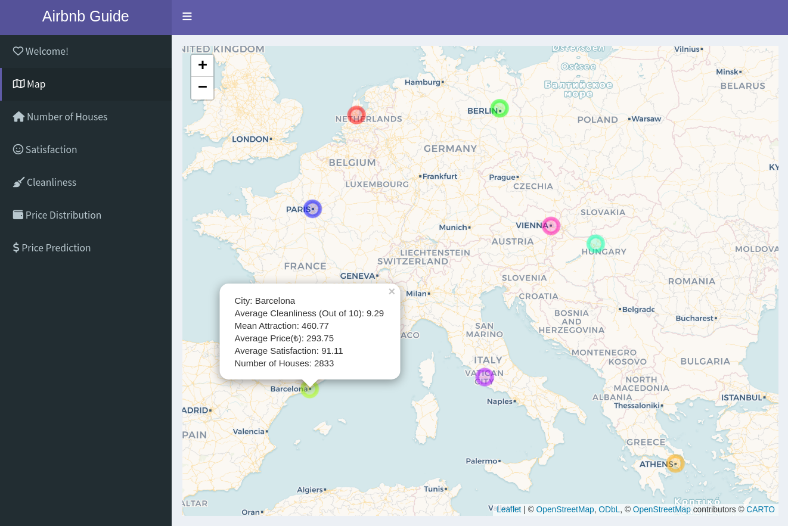

# Airbnb Explorer
Created a R Shiny app for tourists, employing statistical methods like multiple linear regression and logistic regression to compare Airbnb flats. Implemented interactive Leaflet map system for enhanced user engagement. 

## Description
Explore the enchanting cities of Europe through the Airbnb dataset, featuring nine captivating destinations including Amsterdam, Athens, Barcelona, Berlin, Budapest, Lisbon, Paris, Rome, and Vienna. Gain valuable insights into accommodation options, such as price, cleanliness, and guest satisfaction, allowing informed decisions for personalized travel experiences. Uncover patterns and correlations, discovering the allure of each city and immersing yourself in the vibrant cultures and unique offerings of these European gems.

 Map Interface 

  

